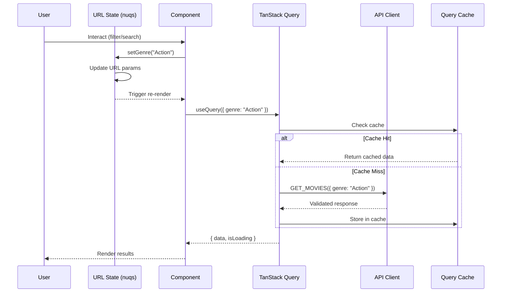
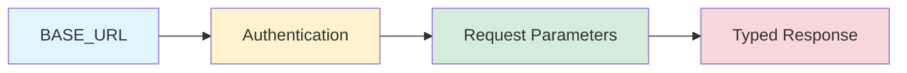
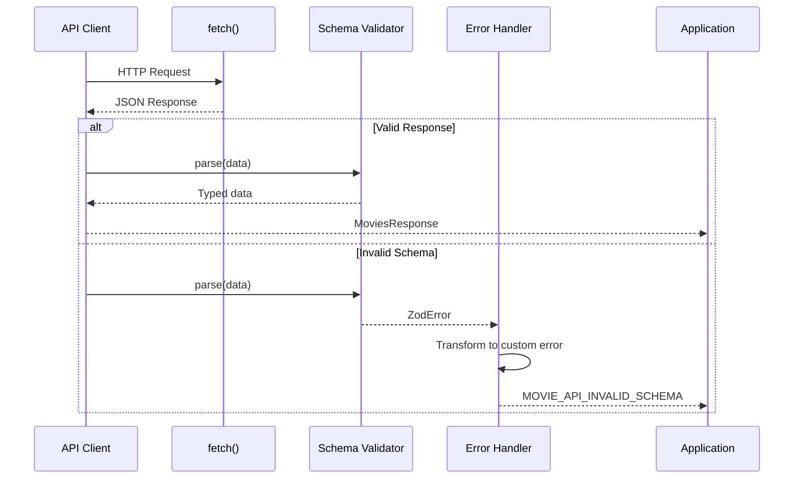
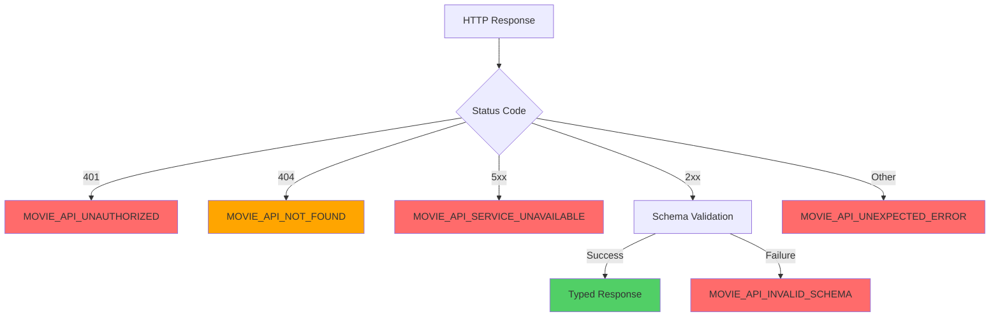
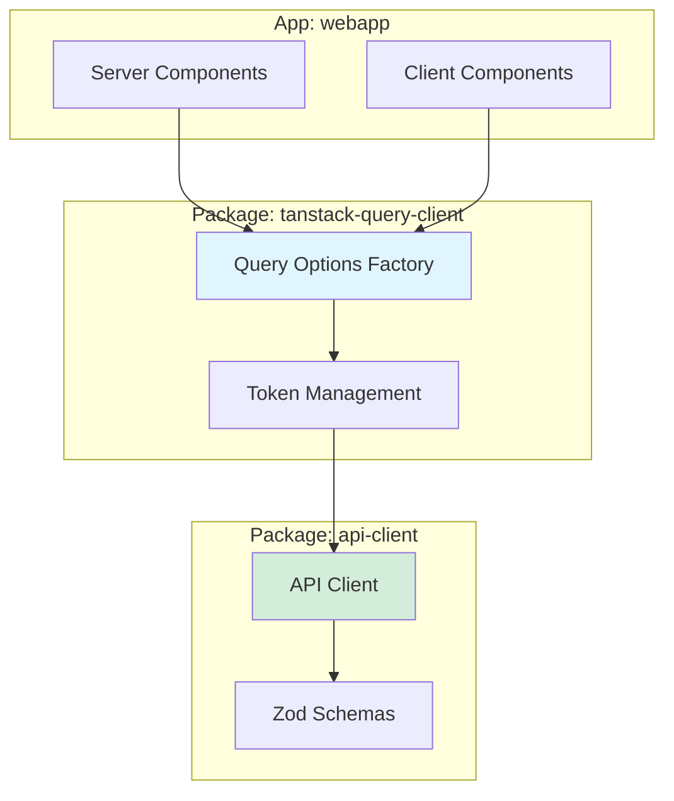
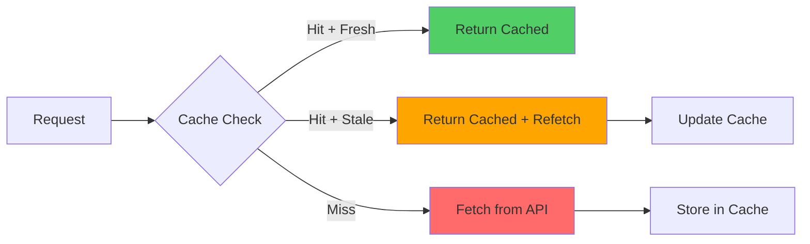

# Movies Explorer - Architecture

> **Note:** This document was auto-generated by Claude Code on October 3, 2025. While the technical details are accurate, the writing style and explanations were produced by AI based on the actual codebase implementation.

Technical architecture for a Next.js 15 movie discovery application. This doc covers the interesting bits: type-safe API design, URL-based state management, and how we're using server-side prefetching to eliminate loading states.

## The Big Picture

We're dealing with a fairly straightforward movie browsing app, but the architecture choices make it interesting. The core challenge was building something that feels instant (no loading spinners on initial page load) while maintaining full type safety from API to UI. Threw in URL-based state management because shareable links are table stakes these days.

The app talks to a REST API, uses TanStack Query for caching, and leverages Next.js 15's server components for prefetching. Everything's in a monorepo because the API client needs to be reusable.

## Data Flow: Server-Side Prefetching

Here's where it gets interesting. Most Next.js apps either go full server-side or full client-side. We're doing both, strategically.

```mermaid
sequenceDiagram
    participant Browser
    participant RSC as Server Component
    participant QC as QueryClient
    API as API Client
    participant External as Movies API

    Browser->>RSC: GET /
    RSC->>QC: prefetchQuery(getMoviesOptions)
    QC->>API: GET_MOVIES({ page: 1, limit: 3 })
    API->>External: fetch + auth token
    External-->>API: JSON Response
    API->>API: Zod validation
    API-->>QC: Typed MovieResponse
    QC-->>RSC: Cached state
    RSC-->>Browser: HTML + dehydrated state
    Browser->>Browser: Hydrate with zero client fetches
```

**The Approach:**

On the server, we create a fresh `QueryClient`, prefetch the initial movie data, then dehydrate that state into the HTML. When the browser hydrates, React Query recognizes the cached data and skips the fetch entirely. User sees content immediately—no loading spinners, no layout shifts.

```typescript
// Server Component - happens during SSR
const queryClient = getQueryClient();
await queryClient.prefetchQuery(getMoviesOptions({
  params: { page: 1, limit: 3 }
}));

return (
  <HydrationBoundary state={dehydrate(queryClient)}>
    <ClientComponent /> {/* Data already here, no loading state */}
  </HydrationBoundary>
);
```

**Why this works:**

TanStack Query's dehydration mechanism serializes the cache state into the HTML. The client-side `QueryClient` recognizes the same query keys and treats the prefetched data as a cache hit. It's effectively zero-cost hydration—you get server rendering benefits without sacrificing client-side interactivity.

The tricky part is managing the `QueryClient` lifecycle. Each server request needs its own instance (requests are isolated), but the client needs a singleton. We handle this in `getQueryClient()` with a simple server/client check.

## Client-Side Queries: URL as State

The search page is pure client-side because it's interactive—typing, filtering, paginating. But here's the twist: all that state lives in the URL, not React state.



**Why URL-based state:**

Simple: shareability. You filter movies by "Action" genre, page 3, and the URL becomes `/search?genre=Action&page=3`. Copy that URL, send it to someone, and they see the exact same results. No special "share" functionality needed.

Browser back/forward navigation works for free. URL changes trigger component re-renders, which trigger new queries. TanStack Query's cache handles deduplication, so rapid back/forward clicks don't hammer the API.

**Implementation:**

```typescript
// All state lives in URL via nuqs
const [search] = useQueryState("q", parseAsString.withDefault(""));
const [genre] = useQueryState("genre", parseAsString.withDefault(""));
const [page, setPage] = useQueryState("page", parseAsInteger.withDefault(1));

// Business rule: reset pagination when filters change
// (otherwise you get "page 5 of 1 page" weirdness)
useEffect(() => {
  if (page !== 1) {
    setPage(1);
  }
}, [search, genre, setPage]); // Intentionally omitting 'page' to avoid loops

// Query automatically reacts to URL parameter changes
const { data } = useQuery({
  ...getMoviesOptions({
    params: { search, genre, page, limit: 25 }
  })
});
```

**The gotcha:**

nuqs requires components to be wrapped in Suspense boundaries. This is because it needs to synchronize URL state during hydration, and Suspense gives React the flexibility to handle that async boundary. Forget the Suspense wrapper and you'll get hydration errors. 🤷‍♂️

## Type-Safe API Client: Currying + Zod

The API client uses a currying pattern for dependency injection. This feels a bit fancy, but it solves a real problem: we need different base URLs and auth tokens for server vs. client, test vs. production, etc.



**The Pattern:**

```typescript
// packages/api-client/src/rest/client.ts
export const GET_MOVIES =
  (BASE_URL: string) =>
  (token: string) =>
  async (request: MoviesRequest): Promise<MoviesResponse> => {
    const url = buildUrl(BASE_URL, '/movies', request);
    const response = await fetch(url, {
      headers: { Authorization: `Bearer ${token}` }
    });

    if (!response.ok) {
      throw mapErrorResponse(response);
    }

    return MoviesResponseSchema.parse(await response.json());
  };
```

**Why curry:**

Partial application. You can create a pre-configured client for a specific environment:

```typescript
const prodClient = GET_MOVIES("https://api.prod.com");
const testClient = GET_MOVIES("https://api.test.com");

// Later, with auth token
const authedProdClient = prodClient(token);
```

This makes testing dramatically easier—mock at the URL level, the token level, or the request level depending on what you're testing.

**Runtime Validation:**

Every API response goes through Zod validation. TypeScript gives you compile-time types, Zod gives you runtime guarantees. If the API changes and starts returning `null` for a field you expected to be a string, Zod catches it and throws a structured error instead of letting it blow up somewhere deep in your component tree.



**Schema-First Design:**

```typescript
// Define the schema
export const MovieSchema = z.object({
  id: z.string(),
  title: z.string(),
  posterUrl: z.string().nullable(),
  ratingValue: z.number().nullable(),
});

// Type automatically inferred from schema
export type Movie = z.infer<typeof MovieSchema>;
```

This is the opposite of most TypeScript codebases where types are defined separately from runtime validation. Here, the schema is the source of truth. Change the schema, and both the types and the validation update automatically.

## Error Handling: Custom Classes

We don't just throw generic errors—we classify them.



**Why custom error classes:**

Because `instanceof` checks let you handle errors precisely:

```typescript
try {
  const movie = await client.GET_MOVIE_BY_ID({ id: "123" });
} catch (error) {
  if (error instanceof MOVIE_API_UNAUTHORIZED) {
    // Redirect to login
    redirect('/login');
  } else if (error instanceof MOVIE_API_NOT_FOUND) {
    // Show 404 page
    notFound();
  } else if (error instanceof MOVIE_API_INVALID_SCHEMA) {
    // Log to error tracking, API contract changed
    captureException(error);
  }
}
```

Generic error handling is a debugging nightmare. Specific error classes make it obvious what went wrong and where.

## Query Options: Centralized Config

We have a dedicated package (`tanstack-query-client`) that exports query option factories. This is important because both server and client need to use identical query configurations—otherwise, you get cache key mismatches and unnecessary refetches.



**Shared Configuration:**

```typescript
// packages/tanstack-query-client/src/index.ts
export const getMoviesOptions = (config: { params: MoviesRequest }) => ({
  queryKey: ["movies", config.params] as const,
  queryFn: async () => {
    const token = await getAuthToken();
    const client = GET_MOVIES(BASE_URL)(token);
    return client(config.params);
  },
  staleTime: 5 * 60 * 1000, // 5 minutes
});

// Server: await queryClient.prefetchQuery(getMoviesOptions(...))
// Client: useQuery(getMoviesOptions(...))
```

**Why this matters:**

Query keys are TanStack Query's cache keys. If the server prefetches with `["movies", { page: 1 }]` and the client queries with `["movies", "1"]`, they're different keys—cache miss, redundant fetch. By centralizing the query options, both server and client use identical keys.

The `as const` assertion is crucial for type inference. Without it, TypeScript widens the array to `string[]` and you lose specificity.

## Parallel Routes: Independent Loading

The header (search bar + genre filter) loads independently from the main content. This is Next.js parallel routes in action.

```mermaid
graph TB
    Layout[Root Layout] --> Header[@header Parallel Route]
    Layout --> Main[Main Content]

    Header --> HeaderSuspense[Suspense Boundary]
    Main --> MainSuspense[Suspense Boundary]

    HeaderSuspense -.->|Independent| HeaderError[Error Boundary]
    MainSuspense -.->|Independent| MainError[Error Boundary]

    style Header fill:#e1f5ff
    style Main fill:#d4edda
```

**What this gives you:**

If the header's genre dropdown needs to fetch 100 genres and takes 2 seconds, but the main content movies load in 200ms, the user sees the movies immediately. The header shows a loading skeleton until its data arrives.

Error isolation is another benefit. If fetching genres fails, you get an error state in the header, but the main content still renders. Without parallel routes, one failing fetch could block the entire page.

```typescript
// app/layout.tsx
export default function Layout({
  children,
  header, // @header parallel route
}: {
  children: React.ReactNode;
  header: React.ReactNode;
}) {
  return (
    <html>
      <body>
        <Suspense fallback={<HeaderSkeleton />}>
          {header}
        </Suspense>
        <main>
          <Suspense fallback={<MainSkeleton />}>
            {children}
          </Suspense>
        </main>
      </body>
    </html>
  );
}
```

Each parallel route can have its own `loading.tsx`, `error.tsx`, and `not-found.tsx`. They're truly independent.

## Caching: Stale-While-Revalidate

TanStack Query's default behavior is aggressive caching with background refetching.



**Configuration:**

```typescript
const queryClient = new QueryClient({
  defaultOptions: {
    queries: {
      staleTime: 5 * 60 * 1000,  // Data fresh for 5 minutes
      gcTime: 10 * 60 * 1000,     // Unused queries garbage collected after 10 min
      refetchOnWindowFocus: false, // Don't refetch when user tabs back
      retry: 1,                    // Only retry failed requests once
    },
  },
});
```

**How it works:**

1. **Fresh data (< 5 min old):** Return immediately from cache, no fetch
2. **Stale data (> 5 min old):** Return stale data immediately, fetch in background
3. **Cache miss:** Fetch from API, show loading state

This is why the app feels fast. Most navigation is instant because queries hit the cache. Even when data is stale, you see something immediately, then it updates if the API returns different data.

**Garbage collection** prevents memory leaks. Queries inactive for 10 minutes are removed from the cache. Active queries (rendered components) are never garbage collected.

## Testing: Why AI Instead of Unit Tests

We're using AI subagents for testing instead of traditional unit/integration/E2E test suites. This is a bit unconventional, so here's the rationale:

**Traditional testing problems:**
- Unit tests: Mock-heavy, brittle, test implementation details
- Integration tests: Complicated setup, flaky, slow
- E2E tests: Even slower, even more flaky, hard to debug

**AI testing advantages:**
- Tests actual user workflows without brittle selectors
- Adapts to UI changes (e.g., button text changes don't break tests)
- Can reason about intent (e.g., "verify pagination resets when changing filters")
- Provides detailed reports with context

**Our agents:**

1. **@e2e-tester**: Spins up the app, navigates through workflows, validates behavior
   - Handles server lifecycle (dev/production modes)
   - Tests across viewports (mobile/tablet/desktop)
   - Monitors console for errors
   - Creates permutations (search + filter + pagination combinations)

2. **@code-analyzer**: Reviews code for logic errors and potential bugs
   - Identifies null/undefined access issues
   - Spots race conditions in state management
   - Validates business rules (e.g., "pagination should reset on filter change")
   - Checks error handling completeness

This isn't a replacement for type checking (TypeScript) or linting (ESLint). It's a replacement for manually written tests.

## Technical Trade-offs

Every architectural decision involves trade-offs. Here's what we chose and why:

### URL State vs. Client State (e.g., Zustand)

**Chosen:** URL-based state with nuqs

**Trade-off:** Requires Suspense wrappers, slightly more complex setup

**Why:** Shareability is non-negotiable for a search/filter interface. URL state gives you that for free, plus browser navigation, SSR compatibility, and no state management library dependency.

### Currying vs. Configuration Objects

**Chosen:** Currying for API client

**Trade-off:** Less familiar pattern, harder to read if you're not used to functional programming

**Why:** Partial application makes testing way easier. Mocking a curried function at any stage (URL, token, request) is trivial. Configuration objects require deeper mocking or factory patterns.

### Server Prefetch vs. Client-Only

**Chosen:** Server-side prefetching with HydrationBoundary

**Trade-off:** More complex setup, need to coordinate server/client query keys

**Why:** Instant page loads. Users see content before JavaScript even executes. SEO benefits are a nice bonus.

### Monorepo vs. Single Package

**Chosen:** Turborepo monorepo

**Trade-off:** More configuration, build complexity, workspace management

**Why:** The API client needs to be reusable (server, client, potentially other apps). Shared TypeScript/ESLint configs ensure consistency. Clear package boundaries prevent tight coupling.

### Runtime Validation (Zod) vs. TypeScript Only

**Chosen:** Zod runtime validation

**Trade-off:** Small runtime overhead, more verbose schemas

**Why:** API contract changes happen. TypeScript can't protect you at runtime. Zod catches schema mismatches and provides detailed error messages. The performance overhead is negligible compared to network requests.

---

**Bottom line:** This architecture prioritizes user experience (instant loads, shareable links) and developer experience (type safety, clear boundaries) over simplicity. It's more complex than a basic Create React App, but the trade-offs are worth it for a production-grade application.
